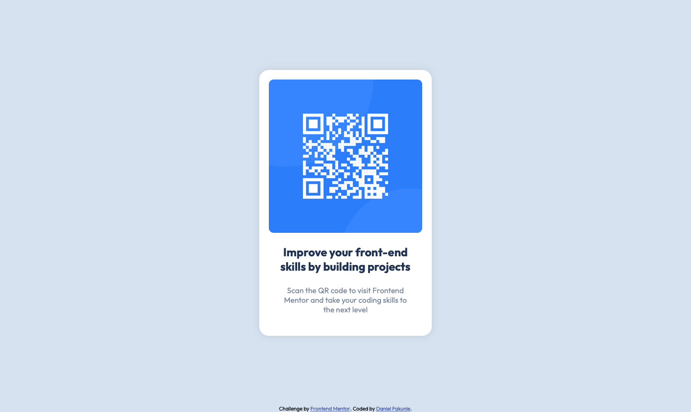

# Frontend Mentor - QR code component solution

This is a solution to the [QR code component challenge on Frontend Mentor](https://www.frontendmentor.io/challenges/qr-code-component-iux_sIO_H). Frontend Mentor challenges help you improve your coding skills by building realistic projects. 

## Table of contents

- [Overview](#overview)
  - [Screenshot](#screenshot)
  - [Links](#links)
- [Author](#author)

**Note: Delete this note and update the table of contents based on what sections you keep.**

## Overview

### Screenshot

### Links

- Solution URL: [Solution](https://www.frontendmentor.io/solutions/qr-code-challenge-5J13Mu3w6r)
- Live Site URL: [Live Sit](https://danielfakunle.github.io/qr-code-challenge/)

## Author

- Frontend Mentor - [@danielfakunle](https://www.frontendmentor.io/profile/danielfakunle)
